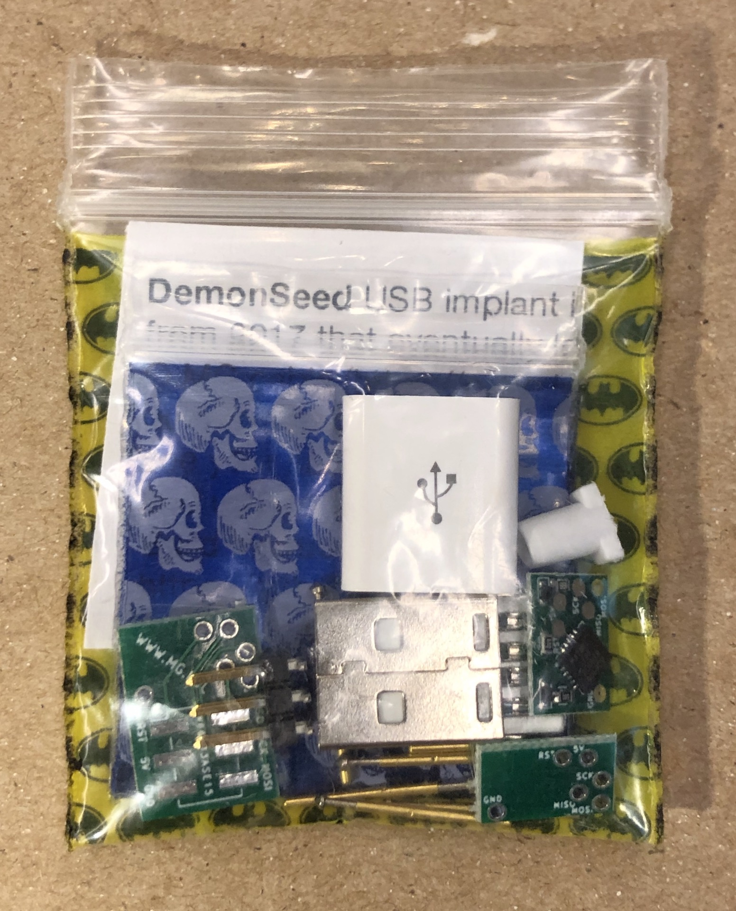
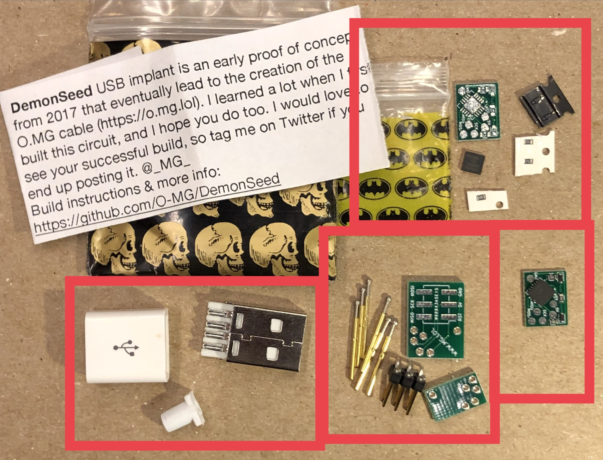
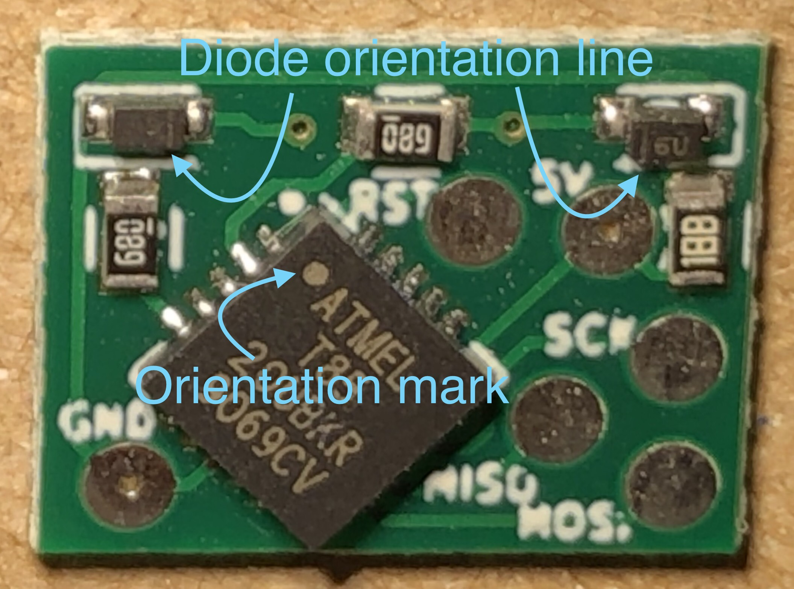
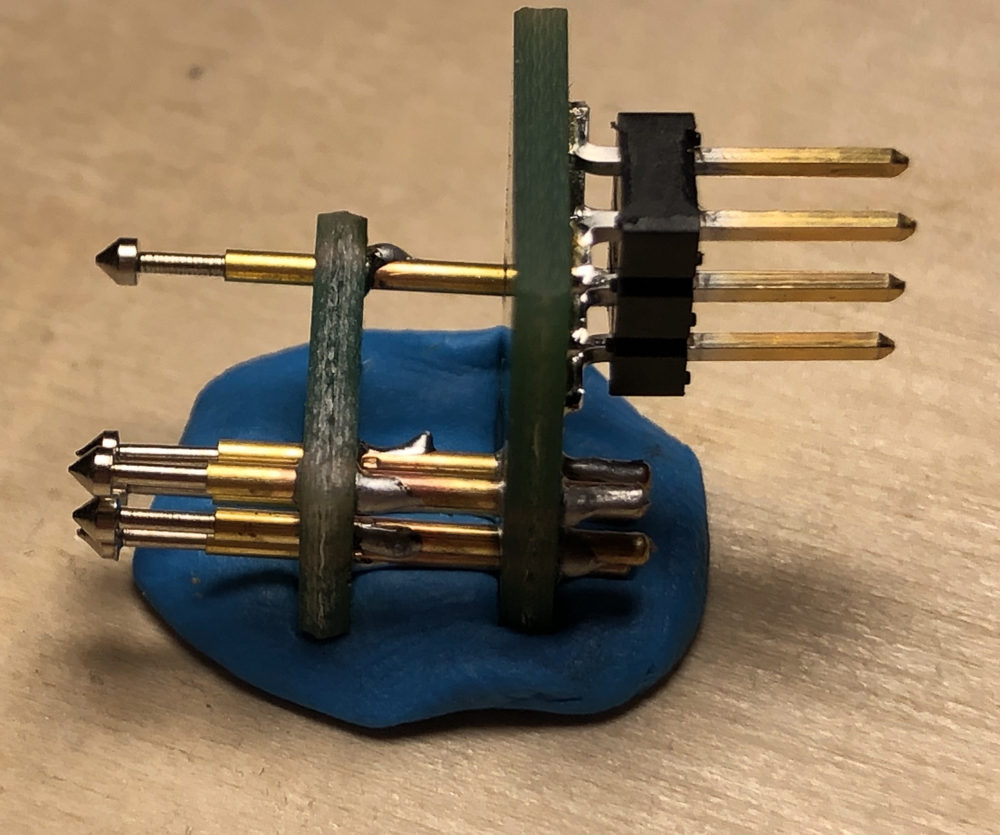
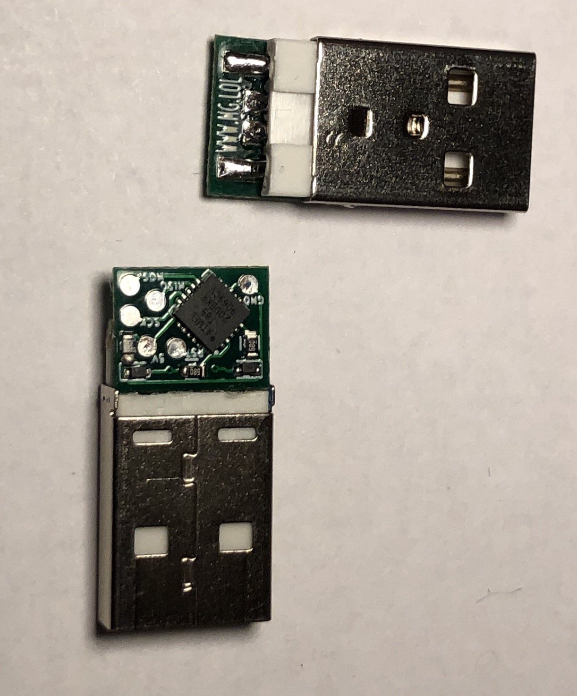
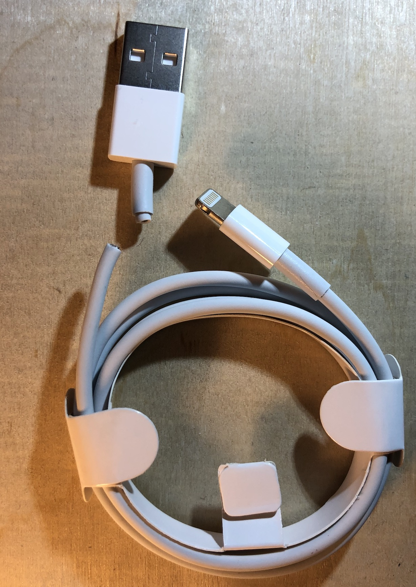
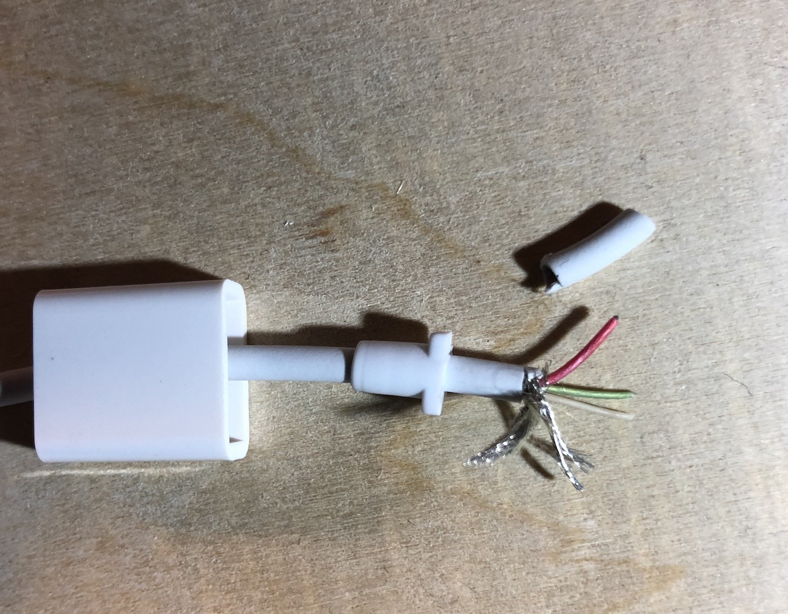
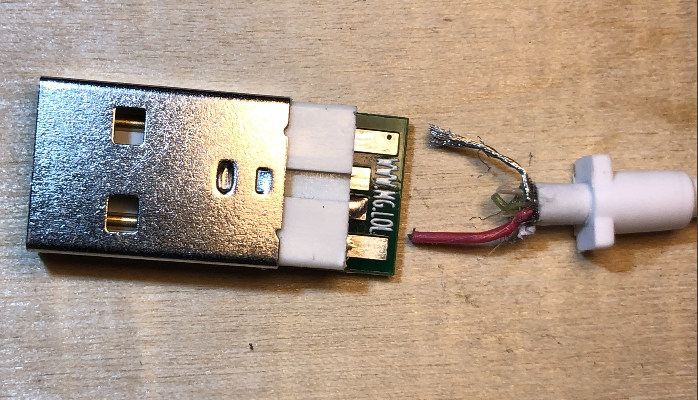
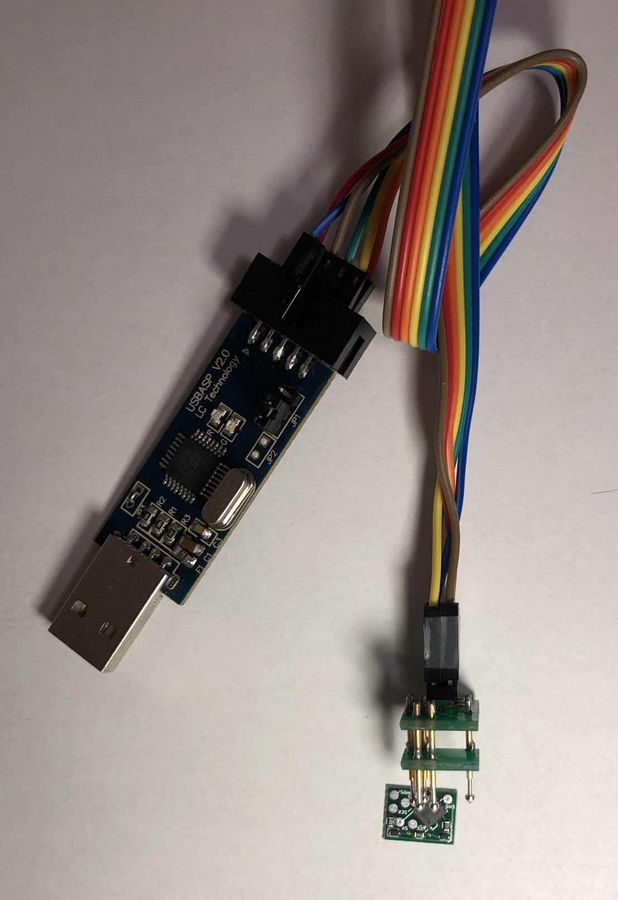
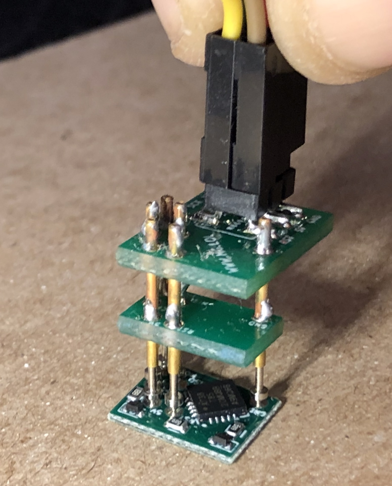

# New version coming Nov! 
**DemonSeed is getting an overhaul. Basic RF trigger, data passthrough (without a switch or hub!), easier programming, and video walkthroughs.**

# 

# D̴̹̭͂ë̷̗́̃̿̓̾͜ṃ̸͔͚̗̙̪̎̄̋ȏ̸̝̤̱͜n̶͇͇͙̻̩͑͑S̴̳̩̮̥͚̥̚ė̸̟̃͋͂͝e̷̪̲̪̰̣̿̀͠d̵̡̂͗

.

DemonSeed is minimal malicious USB cable. Not to be confused with the O.MG Cable (https://o.mg.lol), which is a very differient piece of hardware that does a whole lot more, and is coming very soon :)

**For those with the DEFCON 2019 kit, there are [3 separate build difficulties to choose from](#-assembly-instructions).** And you have the possibility of ending up with 2 functional implant boards when finished. 

Table of Contents
=================

* [Intro](#-intro)
* [Materials](#-Materials)
* [Assembly Instructions](#-assembly-instructions)
  * [Board Assembly](#-board-assembly)
  * [Pogo Programmer Assembly](#-pogo-programmer-assembly)
  * [Cable Assembly](#-cable-assembly)
* [Programming Instructions](#-programming-instructions)
  * [Programming the Bootloader](#-programming-the-bootloader)
  * [Programming a Payload](#-programming-a-payload)
* [License](#-license)

## [↑](#table-of-contents) Intro
In 2017 I started playing around with miniaturizing HID attack hardware inside of USB cables. (https://mg.lol/blog/badusb-cables/) Since then, I have a lot of people request an easier way to reproduce this work, especially after someone ripped off the basic idea from private messages I sent them and started selling a modified version for hundreds of dollars. (hi kevin!) I don't think such a basic circuit is worth that much, but I do think it's a great way to learn about some hardware hacking basics by building your own. 

Yes, "DemonSeed" is another NIN reference :)

When assembled, these cables allow you to program a HID payload that is triggered on power up. The device plugged into the other end will receive power for charging. This makes for a decent educational demo. 

Here is a demo video demonstrating what your cable will look like and be capable of: https://twitter.com/_MG_/status/1054929638621757441

## [↑](#table-of-contents) Materials

This year (2019) at DEFCON I will have a bunch of these as build kits. So come find me! [https://twitter.com/\_MG_](https://twitter.com/_MG_)
In addition to the build kit, you will need some/all of the following depending on what level of build you choose:

* For Basic assembly:  
  * A soldering iron & solder
  * A sacrificial USB cable to implant into. These kits are designed to work with white lightning cables made by Apple, but any cable that fits inside the strain relief should work. 
  * Some Blu Tack/Mounting Putty will make soldering much easier. https://www.amazon.com/s?k=blu+tack

* For bootloader programming: 
  * Female to Female jumper/breadboard cables. 
    * Example: https://www.amazon.com/gp/product/B00R96X8JS/ 
  * An AVR ISP. 
    * There are a lot of options here. You can even make them out of Arduino capable devices, including other ATTiny's. If you don't want to figure this out, I have found the USBasp to be work with minimal work (works on OS X & Linux, need a driver for Windows). https://www.amazon.com/s?k=usbasp This specific one has worked just fine: https://www.amazon.com/gp/product/B00AX4WQ00/. **Just make sure to connect the J3 jumper or it won't work on the ATTiny85** 
    * Not familiar with what an ISP (in system programmer) is? Here is a decent intro: https://www.ladyada.net/learn/avr/programming.html

* For assembly of the unpopulated PCB:
  * Solder Paste
  * A hot air reflow station, hot plate, reflow oven, a [spoon](https://twitter.com/_MG_/status/1152317329646088192) (not really), or any heat source that is appropriate for solder paste reflow.  

Don't have a build kit? Want to source your own parts? 
* per implant: 
  * 2x [DIODE ZENER 3.6V 150MW SSMINI2](https://www.digikey.com/product-detail/en/panasonic-electronic-components/DZ2S036M0L/DZ2S036M0LCT-ND/2269096) (most 3.6V Zener diodes under 500MW that have a SOD523/SSMINI2 footprint should work)
  * 2x [RES 68 OHM 1% 1/10W 0603](https://www.digikey.com/product-detail/en/stackpole-electronics-inc/RMCF0603FT68R0/RMCF0603FT68R0CT-ND/2418121) (any 68 ohm resistor with a 0603 footprint is fine)
  * 1x [RES SMD 1.5K OHM 1% 1/10W 0603](https://www.digikey.com/product-detail/en/yageo/RC0603FR-071K5L/311-1.50KHRCT-ND/729811) (any 1.5k ohm resistor with a 0603 footprint is fine)
  * 1x [IC MCU 8BIT 8KB FLASH 20QFN	](https://www.digikey.com/product-detail/en/microchip-technology/ATTINY85-20MU/ATTINY85-20MU-ND/1245919)
  * 1x USB connector + USB shell + flex relief. http://usb.makerusa.net is a recommended source for these. 
* per pogo programmer: 
  * 1x [CONN HEADER SMD 6POS 2.54MM](https://www.digikey.com/product-detail/en/amphenol-icc-fci/54202-G08-03/609-5602-ND/1488240)
  * 6x P75-E2 pogo pins: https://www.amazon.com/VDBX-io-Pogo-Pins-General-Use/dp/B07DJT5D6J
* PCBs created from the gerber files in this repo
 

## [↑](#table-of-contents) Assembly Instructions
If you have a kit, then you have 2 boards that allow you to choose your own adventure here. 

**Full difficulty**: You can use the unassembled board and do 100% of the assembly. You will need solder paste and a heat source sufficient for solder reflow to start here. 

**Medium difficulty**: You can use the additional assembled board in the kit and skip directly to the pogo programmer assembly. You will need a soldering iron, ISP programmer, something like blu tack/mounting putty to help hold things together while you solder, and a computer with avrdude installed. 

**Easiest difficulty**: You can also use the same assembled board and skip directly to cable assembly because I preprogrammed all of these boards with a bootloader already. You will need a soldering iron and a computer with the Arduino IDE. 

DEFCON 2019 kit: 

### [↑](#table-of-contents) Board Assembly

You will need to use solder paste with a heat source to reflow the solder. Hand soldering is going to be very difficult, especially with the center pad of the QFN ATTiny component. Your board should look like this. The two 68 ohm resistors (marked with "680") and one 1.5k ohm resistor (marked with "188") do not require a specific orientatation. However, the diodes need to have the orientation towards the inside of the board. The ATTiny will also need to have the orientation mark lined up as seen in the picture. 

### [↑](#table-of-contents) Pogo Programmer Assembly

Solder up the 2x3 pin header and the pogo pins as shown in the picture. Make sure the solder stays on the outer brass of the pogo pin and does not bleed over to the tips. Using some blu tack will help a lot when trying to keep everything lined up. The smaller board is intended to help keep the pins lined up while soldering. So place the pogo pins through both boards and hold them into position with the blu tack (as seen in the picture) before you start soldering the pogo pins on. 

### [↑](#table-of-contents) Cable Assembly

***STOP!*** Have you programmed the bootloader? If not, you will probably want run through the bootloader programming section (scroll down) before moving on to cable assembly. You can still program the bootloader after you have attached the board to the connector, but solder sometimes fills in the small holes on the 2 pogo pads, which makes it a little more difficult to keep the programmer in position. 

Now, the first step is to solder the board into the USB connector. Apply a layer of solder to the connector before trying to solder the two together, this will help. Then position the board onto the connector. It helps to turn the assembly on its back, secured on a bed of blu tack, when doing this. **But before you start doing this:**

There are two types of USB connectors and their pins are reversed from eachother. I have made this board "universal" so that it can be used on either type. However, **this means you can install the board backwards and short it out**.  So make sure you know which orientation you need with your connector. For the kit provided during DEFCON 2019, the orientation will look like this: 

***STOP!*** At this point, I recommend verifying that you can interface with DemonSeed via USB. Run through the "Programming a Payload" section (scroll down) and verify that it works. 

Once all functionality is confirmed, you can attach a cable and close up the implant. 

Take your target cable and cut off the USB A connector: 

Add the shell, then the strain relief. Then strip the ends of the cable and remove any of the shielding. Most cables have an outer layer of braided wires and an sheet of metalic plastic (mylar). This should be removed. Make sure you do NOT cut off the inner stranded wires that are often bare. These are the ground wires. 

Now, shorten the data wires (usually white and green). Solder the power and ground wires (make sure you have the correct polarity or you will potentially damage the phone (or any device connected) and/or computer!
I recommend doing some research here, but what I have been doing is simply soldering the data wires together (not attatched to the board in any way). For all the devices I have tested, this allows them to successfully pull a charge from the cable. 

I suggest testing all functionality of the cable at this point. Then, you can close up the enclosure! It helps to add a bit of adhesive to the wires just before you close things up so that they do not get pulled from the solder connections. 

And you are done!

## [↑](#table-of-contents) Programming Instructions
There are two programming requirements. A blank ATTiny85 will need a bootloader flashed and the fuse bits set properly. After that, you can program HID payloads. 

### [↑](#table-of-contents) Programming the Bootloader
If you are using the board that came preassembled in a kit, you can technically skip this step be ause I flashed the bootloader already. However, it is still worth learning how to do this. If you have assembled the empty board with components, the ATTiny is empty so you will want to install a bootloader. 

First, install avr dude:https://learn.adafruit.com/usbtinyisp/avrdude

Then, download a copy of the ATTiny85 binary from the micronucleus project here: https://raw.githubusercontent.com/micronucleus/micronucleus/master/firmware/releases/t85_default.hex Micronucleus provides a really convenient functionality: It allows us to push payloads over a USB interface so we only need to use the pogo programmer once. 

Now, connect your ISP programmer to the 2x3 header on the pogo programmer using the jumper cables. **Please make note of the labeled pins. This 2x3 connector does not use a standard ISP pinout (sorry), so you need to ensure the proper pins are connected** 

Then press the pogo pins against the board. Two of the pads have small holes in the center that help the tips of the pogo pins click into place and keep them there. The operation will look like this: 

Verify connectivity by running `avrdude -c usbasp -p attiny85` (note: you will want to change out "usbasp" to match whatever ISP you are using)

If connectivity is working, you can flash the bootloader and set the [fuse bits](http://eleccelerator.com/fusecalc/fusecalc.php?chip=attiny85) by running `avrdude -c usbasp -p attiny85 -U flash:w:t85_default.hex:i -U lfuse:w:0xe1:m -U hfuse:w:0xdd:m -U efuse:w:0xfe:m`  (note: you will want to change out "usbasp" to match whatever ISP you are using)

### [↑](#table-of-contents) Programming a Payload
Install [Arduino IDE](https://www.arduino.cc/en/Main/Software) if you don't already have it.

If you don't already have the DigiStump board manager installed, do so using [these instructions](http://digistump.com/wiki/digispark/tutorials/connecting). Then select board **DigiSpark (Default - 16.5mhz)** and select programmer **Micronucleus**. 

You can generate a payload script in a variety of ways. I recommend starting with a [DuckyScript](https://github.com/hak5darren/USB-Rubber-Ducky/wiki/Payloads) payload and then converting it with [digiQuack](https://github.com/CedArctic/digiQuack) which will output the converted Arduino/DigiSpark sketch for you. 
Not sure which payload to try? Try this: https://github.com/CedArctic/DigiSpark-Scripts/blob/master/RickRoll_Update/RickRoll_Update.ino

**LICENSE:**

These are intended for personal use and education in a nonprofit way. Please ask if you want utilize these for profit. 

